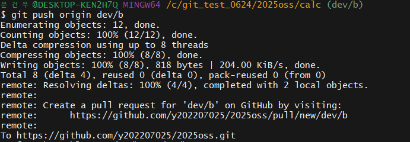

# OSS 기말 재시험

### 저장소: [https://github.com/y202207025/2025oss](https://github.com/y202207025/2025oss)

---

##  팀원 및 역할

| 이름     | 역할 / 수행한 업무 |
|----------|------------------|
| 팀장: 홍준표 | 역할배분, main파일 , 덧셈,뺄셈 구현 및 최종으로 Merge 작업 / dev/a 브랜치 활용  |
| 팀원: 문건우 | 나눗셈, 나머지 연산 구현/ dev/b 브랜치 활용|
| 팀원: 김인선 | 곱셈 구현, dev/c 브랜치 활용 |

---

##  문제 해결 방법 및 진행 순서

1. 요구사항 분석 및 역할 분담 
2. 각각의 브랜치에서 기능들 구현 
3. 팀원들이 git push --all로 구현한 기능 원격지 주소로 업로드
4. 팀장이 main 으로  dev/a, dev/b, dev/c 순으로 병합.
5. main - dev/a 병합때  충돌발생, main - dev/c 병합때 충돌발생, vi로 해당 파일 열어서 충돌발생한 원인 분석후 충돌원인 제거 
6. 중간에 브랜치 하나가 누락되어서 추가작업 
7. README.md 작성 및 이미지 삽입 

